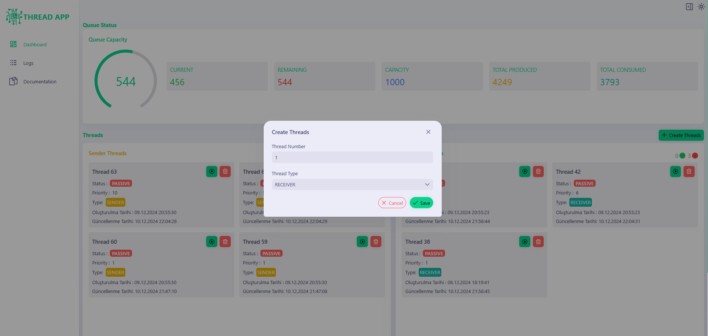
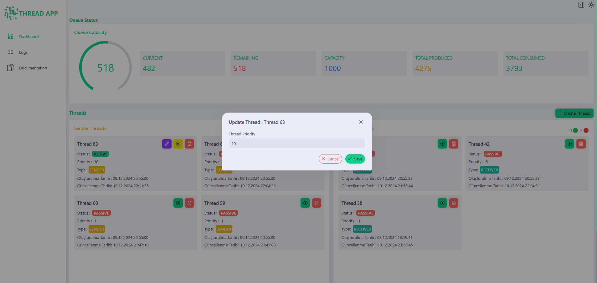
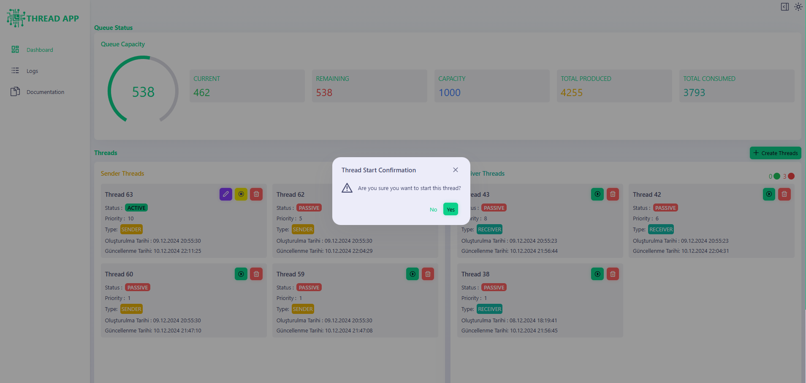
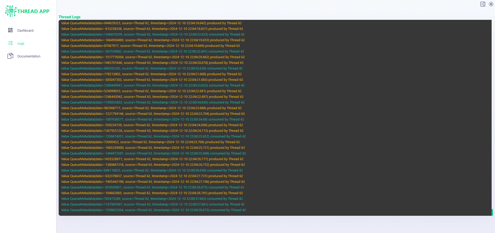
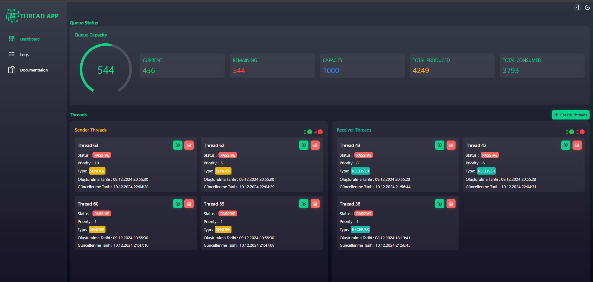
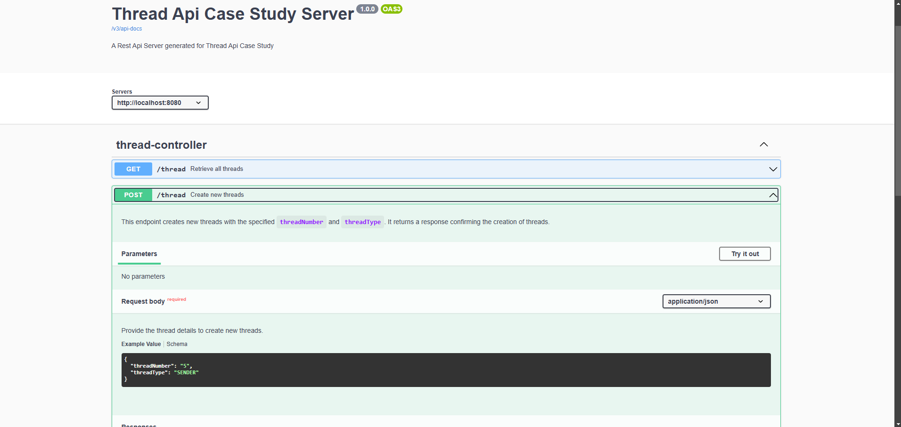
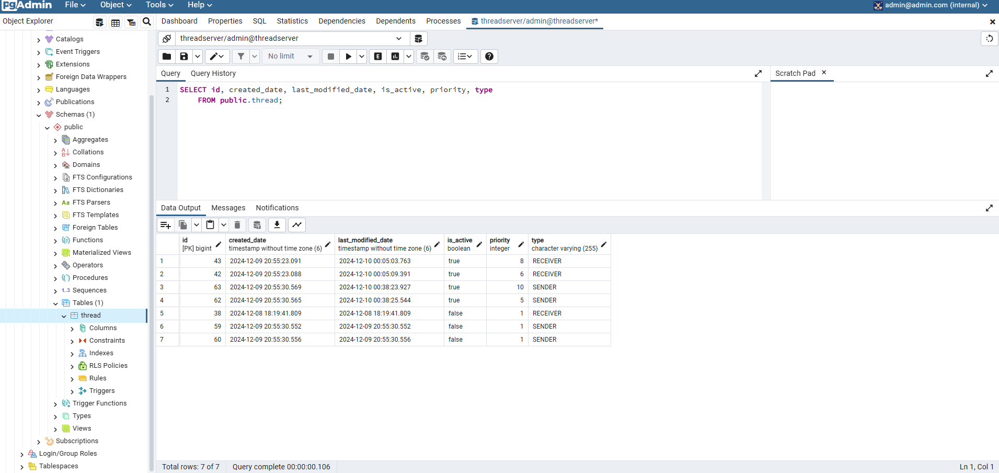

<a name="readme-top"></a>

[![Contributors][contributors-shield]][contributors-url]
[![Forks][forks-shield]][forks-url]
[![Stargazers][stars-shield]][stars-url]
[![Issues][issues-shield]][issues-url]
[![LinkedIn][linkedin-shield]][linkedin-url]

<br />
<div align="center">
  <h3 align="center">Thread Api Full-Stack Engineering Case Study</h3>
</div>

<details>
  <summary>Table of Contents</summary>
  <ol>
    <li>
      <a href="#about-the-project">About The Project</a>
      <ul>
        <li><a href="#built-with">Built With</a></li>
      </ul>
    </li>
    <li>
      <a href="#getting-started">Getting Started</a>
      <ul>
        <li><a href="#prerequisites">Prerequisites</a></li>
        <li><a href="#running-project">Running Project</a></li>
      </ul>
    </li>
    <li><a href="#usage">Usage</a></li>
    <li><a href="#swagger-documentation">Swagger Documentation</a></li>
    <li><a href="#database">Database</a></li>
    <li><a href="#contact">Contact</a></li>

  </ol>
</details>

## About The Project

A project developed for creating and monitoring sender-receiver threads in real-time. Spring Boot is used to build backend server with PostgreSQL Database and Reactjs is used to build client application with vite plugin.
WebSocket is used to reflect instant changes to client, REST API is used for creating and managing resources in server.

<p align="right">(<a href="#readme-top">back to top</a>)</p>

### Built With

- [![Spring][Spring]][Spring-url]
- [![PostgreSql][postgresql]][postgresql-url]
- [![React][react]][react-url]

<p align="right">(<a href="#readme-top">back to top</a>)</p>

## Getting Started

This project can be run using docker-compose.yml file.

### Prerequisites

- Java 17+
- Docker
- Maven
- Node.js

### Running Project

Run the application via docker-compose.yml file

```sh
git clone https://github.com/numankaf/thread-api-case-study.git
cd thread-api-case-study
docker-compose up --build
```

<p align="right">(<a href="#readme-top">back to top</a>)</p>

## Usage

Some example usages of the application:

### Create Threads



### Update Thread



### Start Thread



### Logs Page



### Dashboard in dark mode



<p align="right">(<a href="#readme-top">back to top</a>)</p>

## Swagger Documentation

To access Swagger Documentation, navigate to [http://localhost:8080/swagger-ui/index.html](http://localhost:8080/swagger-ui/index.html)


<p align="right">(<a href="#readme-top">back to top</a>)</p>

## Database

You can view the database using pgAdmin interface runnin on docker container, navigate to [http://localhost:5050/browser/](http://localhost:5050/browser/)


<p align="right">(<a href="#readme-top">back to top</a>)</p>

## Contact

Numan Kafadar - numankafadar97@gmail.com

Project Link: [https://github.com/numankaf/thread-api-case-study](https://github.com/numankaf/thread-api-case-study)

<p align="right">(<a href="#readme-top">back to top</a>)</p>

[contributors-shield]: https://img.shields.io/github/contributors/numankaf/thread-api-case-study.svg?style=for-the-badge
[contributors-url]: https://github.com/numankaf/thread-api-case-study/graphs/contributors
[forks-shield]: https://img.shields.io/github/forks/numankaf/thread-api-case-study.svg?style=for-the-badge
[forks-url]: https://github.com/numankaf/thread-api-case-study/network/members
[stars-shield]: https://img.shields.io/github/stars/numankaf/thread-api-case-study.svg?style=for-the-badge
[stars-url]: https://github.com/numankaf/thread-api-case-study/stargazers
[issues-shield]: https://img.shields.io/github/issues/numankaf/thread-api-case-study.svg?style=for-the-badge
[issues-url]: https://github.com/numankaf/thread-api-case-study/issues
[linkedin-shield]: https://img.shields.io/badge/-LinkedIn-black.svg?style=for-the-badge&logo=linkedin&colorB=555
[linkedin-url]: https://www.linkedin.com/in/numan-kafadar-5b05bb22a/
[Spring]: https://img.shields.io/badge/Spring-6DB33F?style=for-the-badge&logo=spring&logoColor=white
[Spring-url]: https://spring.io/
[postgresql]: https://img.shields.io/badge/PostgreSQL-336791?style=for-the-badge&logo=postgresql&logoColor=white
[postgresql-url]: https://www.postgresql.org/
[react]: https://img.shields.io/badge/React-20232A?style=for-the-badge&logo=react&logoColor=61DAFB
[react-url]: https://reactjs.org/
